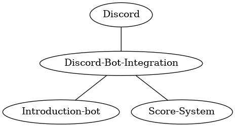
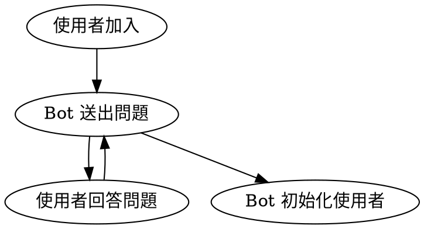
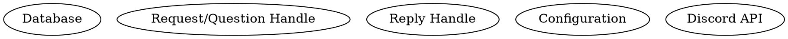

# 6/17 meeting

## System Architecture

## Discord-Bot-Integration

* Database
* Interaction with Discord API
    * Role
    * Nickname
    * Send Message
    * Receive Message
* Use keyword to trigger bot module

## Intro bot user flow

* 使用者加入
    * DB 創 Entry
    * Primary Key 用 Discord ID
    * Welcome page

* 問題要有那些?
    * 細部的不用討論
    * 保留增減問題的彈性
    * 答案直接加到 DB (Due to Async)
    * 學校原則上用學校簡寫，有重複的用我們自己的簡寫
        * 可以有個外部的 HackMD 當參考

* 初始化使用者的項目
    * Assign a role

* what kind of question / reply we can support
    * multiple choices (With reaction)
    * plain text

### System design

* Database
    * 連接到 DB 的部分

### Database Schema

TODO

### Class / Functions

## Score bot

### Role

* User
* Manager

### Features

* View score [User]
    * self
    * others
* Edit score [Manager]
    * Add
    * Deduct
* Transfer [User]
* Logging
* API

### Use Scenarios

#### View Score

* Set nickname
    * Nickname only used for score
    * Don't let user change server nickname (Discuss with Ian)

#### Edit Score

##### Add

TODO

##### Deduct

TODO

## Work flow

### First time

* Fork repository
* Clone to local machine

### Normal time

* Open Issue
* Assign Issue to someone
* Move to "In progess"
* Once finished, open pull request
* [On meeting] Review & merge pull request
* [On meeting] Close issue & Move to "Done"

## TODO List

### Discord-Bot-Integration

* [ ] Database schema
    * Tables? [Chloe]
* [x] Git submodule among repositories [Luis]
* [x] Infrastructure to connect with Database [Brian]
* [x] Infrastructure to connect connect with Discord API [Brian]
* [ ] Settings / Infrastructure with workflow
    * Setup project
    * CI / CD integrate with Repl.it [Low priority][Brian]

### Intro bot

* [x] Infrastructure with Bot-Integration [Luis]
* [ ] Welcome page contents [Later]
* [ ] Question / Reply contents [Later]
* [ ] Survey how to configure Questions / Reply [Brian, Chloe]
    * JSON?
